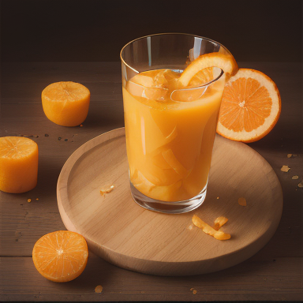

# Image-to-Prompt Inversion with Metric-Guided Search

Given a target image and a fixed diffusion model, find the text prompt that reproduces it.

This isn't captioning — a prompt only "succeeds" if rendering it through a fixed **LCM (Latent Consistency Model)** with a known seed produces an image that is visually close to the target, scored by a weighted combination of CLIP similarity, LPIPS perceptual distance, and pixel-level MSE.

## Results

| Target | Recovered (CLIP 0.94, score 1.00) |
|---|---|
|  |  |

> *"a clear glass filled with fresh orange juice decorated with orange slices and pineapple pieces, still life product shot, glass placed slightly right of center, tabletop view with fruit arranged around the glass, warm brown tabletop with a round wooden board on the left and soft neutral background, more faithful colors"*

| Target | Recovered (CLIP 0.92, score 0.84) |
|---|---|
|  |  |

> *"a lone astronaut is seen standing on the surface of a dark alien planet, with a massive reddish planet looming large above, set against a backdrop of stars and space"*

More examples for all 6 targets, across every optimization round, are in [`outputs/final_top3_gallery/`](outputs/final_top3_gallery/).

## Approach

```
target image → VLM caption (BLIP) → structured visual analysis → modifier-bank expansion
            → deterministic LCM render → multi-metric scoring → rank → refine
```

The search runs in three rounds, each narrowing in on the top-scoring candidates from the last:

1. **Initial expansion** — BLIP generates a caption, which is combined with a structured visual analysis (subject, composition, lighting, camera, style) and a bank of global modifiers (style/lighting/camera/background) to produce 10 candidate prompts per target.
2. **Metric-guided refinement** — the top-3 candidates from round 1 are mutated (10 variants each) using targeted changes driven by which metric is underperforming.
3. **LLM refinement** — the top-3 candidates are handed to `llama-3.1-8b-instant` (Groq API) along with their metric breakdown, which proposes 4 revised variants each, explicitly instructed to reconcile mismatches between the target description and the current prompt.

Every render is deterministic: the seed is derived from the target filename and reused for every candidate, so scores are comparable across rounds and reproducible across runs.

### Scoring

```python
score = 0.45 * clip_similarity_norm + 0.45 * (1 - lpips_norm) + 0.10 * (1 - mse_norm)
```

CLIP and LPIPS are weighted equally as the primary semantic/perceptual signals; MSE contributes a smaller pixel-level correction. All three are min-max normalized *within each target's candidate pool* before combining, so no single metric's raw scale dominates.

### Models

| Component | Model | Role |
|---|---|---|
| Image generator | `SimianLuo/LCM_Dreamshaper_v7` | Deterministic 8-step render from prompt + seed |
| Caption init | `Salesforce/blip-image-captioning-base` | Seeds round-1 candidates with a visual description |
| Semantic metric | `openai/clip-vit-base-patch32` | Image–image cosine similarity |
| Perceptual metric | LPIPS (AlexNet backbone) | Deep-feature visual distance |
| Prompt refinement | `llama-3.1-8b-instant` (Groq) | Metric-aware prompt rewriting |

## Project structure

```
├── prompt_inversion/     # The pipeline: rendering, metrics, candidate generation, scoring, refinement
├── TP2_Project.ipynb     # Orchestration + the demo run over the 6 target images
├── tp2-chosen/           # 6 target images used as inversion targets
├── outputs/              # Summary CSVs + final_top3_gallery/ (per-run candidates are gitignored)
└── assets/examples/      # Images used in this README
```

## Running it

```bash
pip install -r requirements.txt
```

LLM refinement (round 3) needs a Groq API key — get one from the [Groq Console](https://console.groq.com/), then create a `.env` file in the project root:

```env
GROQ_API_KEY=your_key_here
```

Then run the notebook:

```bash
jupyter notebook TP2_Project.ipynb
```

A GPU is strongly recommended (all models run in float16 on CUDA, with float32 CPU fallback). Results land in `outputs/`, including `final_prompts.csv` (best prompt per target) and `final_top3_gallery/` (rendered comparisons).

## Notes

- CLIP similarity on the final prompts ranges 0.81–0.94 across the 6 targets; LPIPS 0.53–0.67; MSE 0.026–0.065.
- BLIP captioning uses beam search and isn't seeded, so initial captions vary slightly run to run — this only affects round-1 initialization, not final results, since later rounds are driven entirely by the deterministic metrics.
- Originally built as coursework (IAG, MIACD).
